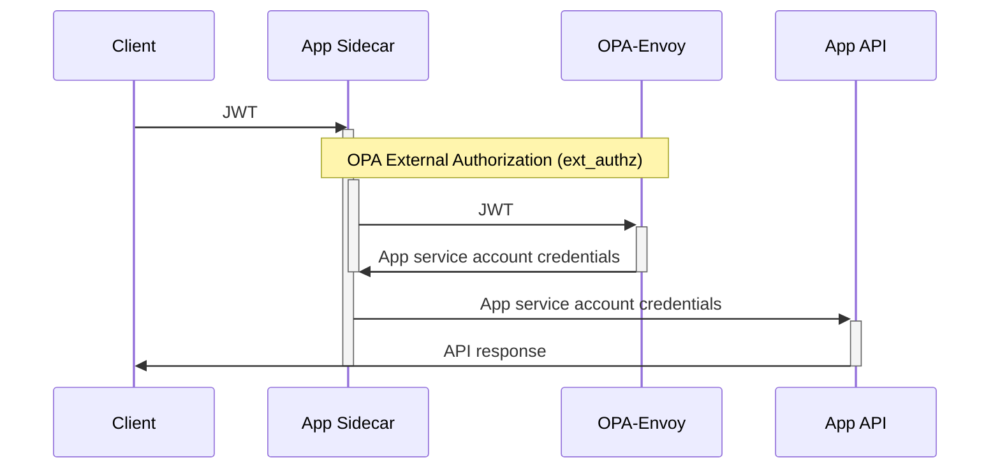

# OPA Istio External Authorization proof of concept

This is a small proof of concept project with some OPA policy for validating requests to multiple apps in an istio cluster.

[opa-envoy-plugin](https://github.com/open-policy-agent/opa-envoy-plugin) provides a GRPC service implementing the Envoy ext_authz protocol. Istio can be configured with [external authorization](https://istio.io/latest/docs/tasks/security/authorization/authz-custom/) to validate (and modify) requests using this server. One instance of OPA is deployed (a sidecar configuration is not used) in this example.

```
./test.sh
```

or

```
istioctl operator init
kubectl apply -f istiooperator.yaml
# Wait for Istio to come up, then:
kustomize build . | kubectl create -f -
```

Tested with Istio 1.10.1 and OPA `0.29.1-envoy`.

**NOTE: OPA is configured without any authentication in this example.**

- Centralized OPA instance with modular policy structure allowing different policy for each app
  - Policy is selected based on destination Istio `principal` (SPIFFE URL including namespace and service account)
- JWT static secret validation
- JWT validation using JWKS HTTP endpoint

## Header manipulation

See `plugins["envoy_ext_authz_grpc"].path` docs at: https://www.openpolicyagent.org/docs/latest/envoy-introduction/ for the syntax on the `allow { ... }` rules. If the response is an object with a `headers` value, they will be sent upstream when `allowed: true`. This allows replacing an `authorization` header (or any other header) before sending it upstream. It is not possible to remove the `Authorization` header with the fields that opa-envoy-plugin provides (`allowed_upstream_headers` from ext_authz can't be configured with opa-envoy-plugin).

It is possible for OPA to accept a JWT, enforce poicy and then swap the credentials for something else before sending them onto an upstream application. This allows putting complex policy validation in front of an application that may not even JWTs at all.  The one risk to avoid is that the upstream application MUST NOT ever send the final credentials back to the downstream user.




## See also

- https://istio.io/latest/blog/2021/better-external-authz/
- https://istio.io/latest/docs/tasks/security/authorization/authz-custom/
- https://istio.io/latest/docs/reference/config/security/authorization-policy/
- https://www.envoyproxy.io/docs/envoy/latest/api-v3/extensions/filters/http/ext_authz/v3/ext_authz.proto
